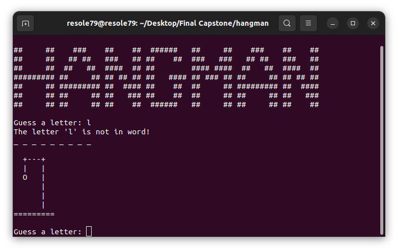
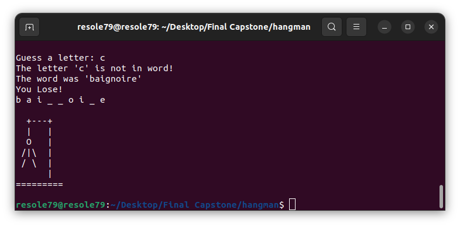

## Hangman Game

Program for **Hangman Game**

Hangman is a guessing game for one player.     
The word is random from [raw.githubusercontent.com](https://raw.githubusercontent.com/matthewreagan/WebstersEnglishDictionary/master/dictionary.json)     
The player tries to guess it by suggesting letters within a certain number of guesses.       

###### It's a part of the **#100DaysOfCode** challenge by Angela Yu. ######


#### Installation
To get started with the Hangman Game, follow these steps:

1. **Install** requests
```sh
pip install requests
```

1. **Clone** the repository:

```sh
git clone https://github.com/resole79/hangman.git
```

2. **Run** the **hangman.py** file:

```sh
python3 hangman.py
```     

#### *File Structure*
 - hangman.py: Main program.
 - art.py : File contains the draws


#### **Usage**

```
##     ##    ###    ##    ##  ######   ##     ##    ###    ##    ## 
##     ##   ## ##   ###   ## ##    ##  ###   ###   ## ##   ###   ## 
##     ##  ##   ##  ####  ## ##        #### ####  ##   ##  ####  ## 
######### ##     ## ## ## ## ##   #### ## ### ## ##     ## ## ## ## 
##     ## ######### ##  #### ##    ##  ##     ## ######### ##  #### 
##     ## ##     ## ##   ### ##    ##  ##     ## ##     ## ##   ### 
##     ## ##     ## ##    ##  ######   ##     ## ##     ## ##    ## 
```

**How program present**

<p align="center"><br><i></i></p>

<p align="center"><br><i></i></p>

## **Credit**

Author : Emilio Reforgiato (resole79)

##
<p align="right"><a href="https://www.linkedin.com/in/emilio-reforgiato/" target=”_blank” ></a></p>


